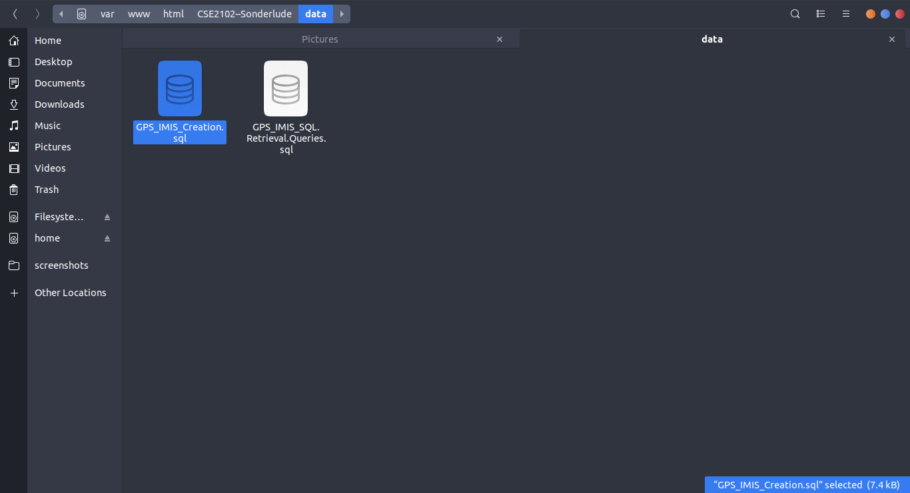
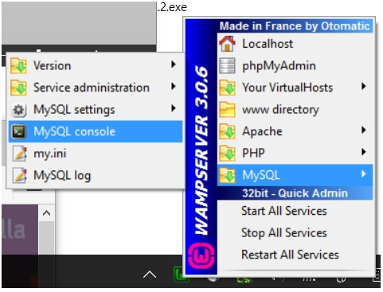
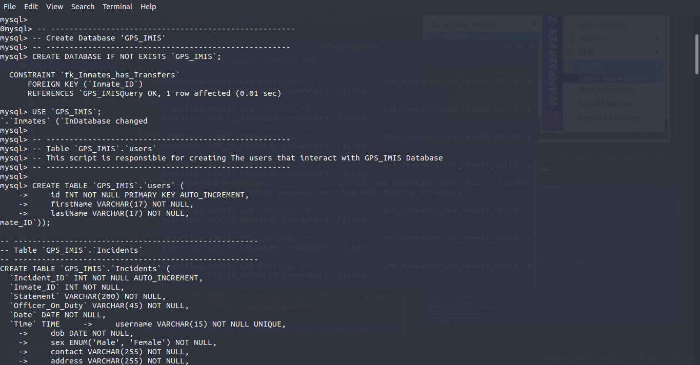
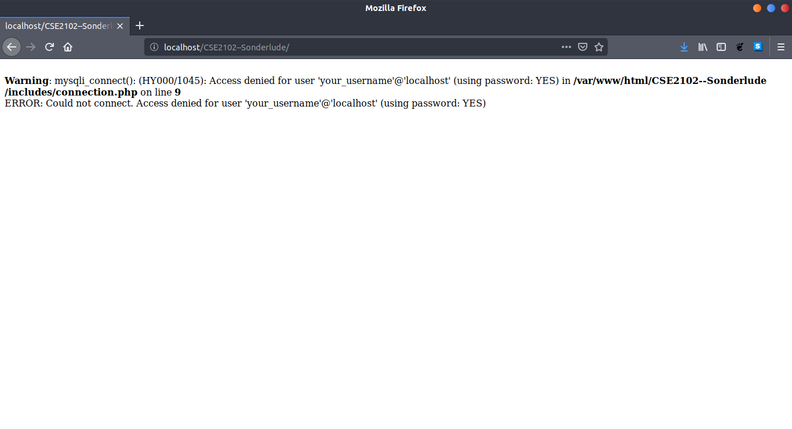
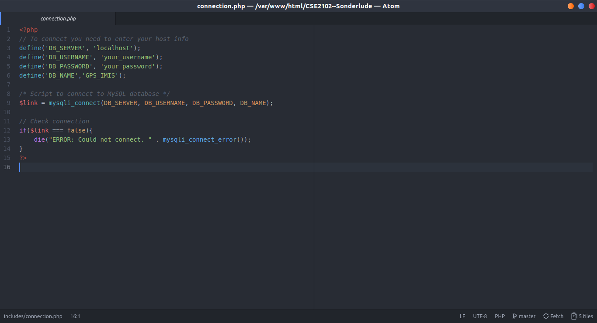

# Sonderlude Development Inc.


GENERAL INFORMATION

This database dubbed the Inmate Management Information System (IMIS) is necessary for the smooth and efficient management of the Two Thousand plus (2000+) criminal population incarcerated within five (5) locations managed by the Guyana Prison Service (GPS). The IMIS will replace the current inefficient paper based system that are prone to mistakes,
and will provide faster reporting and information retrieval as well as more precise data management.


# Installation

In order to experience **The IMIS Application** as we intended. You need to follow these Steps:

### Step 1

Ensure that your System have **Apache, Mysql and PHP and "phpMyAdmin"** installed:

* **Linux OS** [LAMP Server Installation](https://www.digitalocean.com/community/tutorials/how-to-install-linux-apache-mysql-php-lamp-stack-ubuntu-18-04 "Click the link & Follow the Steps") then install [phpMyAdmin](https://www.digitalocean.com/community/tutorials/how-to-install-and-secure-phpmyadmin-on-ubuntu-18-04 "Click the link & Follow the Steps")

* **Windows OS** [WAMP Server Installation](https://sourceforge.net/projects/wampserver/ "Click the link & Follow the Steps") then install [phpMyAdmin](https://www.phpmyadmin.net/downloads/ "Click the link & Follow the Steps")

* **Mac OS** [MAMP Installation](https://www.youtube.com/watch?v=I6sTPp779mA&t=382s "Click the link & Follow the Steps")

### Step 2

Install **Git** to complete the following tasks

#### Linux OS
Debian-based Distributions:
Open Terminal and paste the Command
```bash
sudo apt update
sudo apt upgrade
sudo apt install git
```

#### Windows OS

click here [Git for Windows](https://git-scm.com/download/win)

#### Mac OS
click here [Git for Mac](https://www.atlassian.com/git/tutorials/install-git)

---
After installing **Git** Navigate to your **MySQL Server's Default Data Folder**

* **Linux OS** File Path: ```/var/www/html```

* **Windows OS** File Path ```c:\wamp\www``` OR ```c:\wamp64\www```

* **Mac OS** File path ```/Applications/MAMP/htdocs```

### Step 3

After success Ensure that you are in the **MySQL Server's Default Data Folder** for your Operating System. Then Install **CSE2102--Sonderlude** using ```git clone``` Command

#### Linux and Mac OS
Open "Terminal" with the "MySQL Server's Default Data File Path", and then **copy & paste** the Command
```bash
git clone https://github.com/seraph2girl/CSE2102--Sonderlude.git
```

#### Windows OS
Open "Command Prompt (cmd)" with the "MySQL Server's Default Data File Path", and **copy & paste** the Command
```bash
git clone https://github.com/seraph2girl/CSE2102--Sonderlude.git
```

### Step 4
After installing "CSE2102--Sonderlude" successfully. Open the "CSE2102--Sonderlude" folder and Navigate to the **data** folder there you will see **GPS_IMIS_Creation.sql**:



Now open the "Command Prompt" or "Terminal" to access the mysql database

* #### Linux and MAC OS
Type the following command to access MySQL Database. Provide User Name & Password
```bash
mysql -u username -p your_password
```

* #### Windows OS
Navigate to the "Notification Tray" and click on the WAMP icon



* Open the "GPS_IMIS_Creation.sql" file, then "Copy & Paste" the SQL syntax into the **mySQL Console**



# Using IMIS
After creating the "GPS_IMIS" Database follow steps:

* Open your "Web Browser" and type ```localhost/CSE2102--Sonderlude/```



* Navigate to **connection.php** and fill in your mySQL Credentials



* After providing your credentials The Register Page for Administrator should only appear, because the Database is empty and Only a "Administrator" must first be present.

#### Sonderlude Development Team

| Name     | Position          | Contact |
| -------- | -------------- | -----------
| Towana Wilson | Project Leader/ Database Administrator | https://github.com/seraph2girl
| Kieron Abrigo | UI Developer | https://github.com/KieronShadow
| Lo-Reese Cummings | QA Leader |  https://github.com/Lo-ReeseCummings
| Wilton Lawrence | Back-End Developer | https://github.com/Wilton2
| Jornel Yearwood | UI Developer | https://github.com/Jornelyearwood
